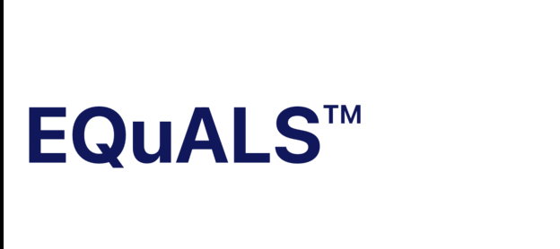

#  EQuALS

## Our Goal

The goal of our project is to develop a mobile application of a web application call "EQuALS". 
We will make sure all the functionality the [web application](https://equals.prepareinc.us) have 
wil not be lose during the implementation. In addition, the overall UI/UX will be re-design to meet the mobile standard. 

## What we will create

By the end of the course, we will have the app availble on appStore and user will be able to register and login to access the content.

## What we will learn

* Mobile app development
* Working knowledge of SWiftUI and XCode 
* UI/UX design for mobile application 
* Team-oriented development setting

>This is a capstone project for course ICSI 499: Capstone Project @ University at Albany. Our sponsor is Mark Mitalski from EQuALS, LLC.  [www.equals.prepareinc.us](https://equals.prepareinc.us)

